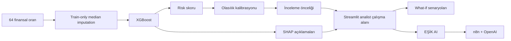

# EŞİK — Financial Risk Early Warning & Analyst Prioritization

**MIUUL AI Data Scientist Bootcamp Graduation Project**

**Ayşe Simal Alpözer** · **Berat Bolat**

> EŞİK yalnızca “Bu şirket riskli mi?” sorusuna cevap vermeyi değil, **analistin önce hangi şirketleri incelemesi gerektiğini, nedenini ve farklı finansal senaryolarda sonucun nasıl değiştiğini** görünür kılmayı amaçlayan uçtan uca bir karar destek projesidir.


## Neden EŞİK?

İflas tahmini gibi dengesiz sınıf problemlerinde yüksek accuracy tek başına yeterli değildir. EŞİK bu nedenle problemi yalnızca ikili sınıflandırma olarak değil, **inceleme kapasitesi altında önceliklendirme** problemi olarak ele alır.

Ana operasyonel soru:

**“Tüm şirketleri inceleyemiyorsak, ilk %10’da hangi şirketleri yakalayabiliyoruz?”**

Bu yaklaşım nedeniyle model değerlendirmesinde özellikle **Recall@10** ve **Lift@10** öne çıkar.

## EŞİK neler yapıyor?

- Şirketleri finansal risk skoruna göre **inceleme önceliğine** sıralar.
- Ham model skorunu **olasılık kalibrasyonu** ile daha yorumlanabilir hale getirir.
- Şirket bazında riski artıran ve azaltan göstergeleri **SHAP** ile açıklar.
- Eksik finansal girdileri ve modelin bunları nasıl ele aldığını kullanıcıya görünür kılar.
- **What-if senaryoları** ile finansal göstergelerdeki değişimin risk çıktısına etkisini gösterir.
- **Streamlit** üzerinde analist çalışma alanı sunar.
- **EŞİK AI** ile model çıktılarının doğal dilde sorgulanmasını sağlar.
- Rapor üretimi ve paylaşımı için yerel **n8n** akışlarıyla entegre çalışabilir.

## Sonuç özeti

Aşağıdaki değerler depodaki mevcut **tarihsel test örneklemi** içindir:

| Ölçüm | Sonuç |
|---|---:|
| Test şirketi | 1.170 |
| Gerçek pozitif / iflas | 82 |
| İlk %10’da incelenen şirket | 117 |
| İlk %10’da yakalanan iflas | 67 |
| **Recall@10** | **%81,71** |
| **Precision@10** | **%57,26** |
| **Lift@10** | **8,17×** |
| Average Precision | 0,7813 |
| ROC-AUC | 0,9547 |

> Bu test örneklemi daha önce proje geliştirme ve karşılaştırma sürecinde incelenmiştir. Bu nedenle sonuçlar yeni ve bağımsız bir üretim doğrulaması olarak sunulmaz.

## Model seçimi

Çalışan bu sürümde **XGBoost** kullanılır. Model ailesi seçimi, beş dış katın ortalama Recall@10 sonucuna göre yapılmıştır:

| Ölçüm | XGBoost | LightGBM |
|---|---:|---:|
| 5 dış katta ortalama Recall@10 | **%79,15** | %77,61 |
| Tarihsel test Recall@10 | %81,71 | **%85,37** |

XGBoost dış kat ortalamasında daha yüksek ve daha düşük katlar-arası değişkenlik göstermiştir; tarihsel testte ise LightGBM daha yüksek yakalama sağlamıştır. Bu nedenle proje **XGBoost’un her koşulda üstün olduğunu iddia etmez**.

Ayrıntılı karşılaştırma: [docs/MODEL_KARARI_VE_KARSILASTIRMA.md](docs/MODEL_KARARI_VE_KARSILASTIRMA.md)

## Mimari



## Veri

Proje, UCI Machine Learning Repository’de yayımlanan **Polish Companies Bankruptcy** veri setinin **5year** altkümesini kullanır.

- Temizlenmiş kayıt sayısı: **5.850**
- Girdi: **64 finansal oran**
- Geliştirme kümesi: **4.680**
- Tarihsel test kümesi: **1.170**
- Kaynak veri lisansı: **CC BY 4.0**

Kaynak: [Tomczak, S. (2016), Polish Companies Bankruptcy — UCI](https://archive.ics.uci.edu/dataset/365/polish+companies+bankruptcy+data)  
DOI: [10.24432/C5F600](https://doi.org/10.24432/C5F600)

Finansal gösterge tanımları ve kaynak notları: [docs/veri-sozlugu-notlari.md](docs/veri-sozlugu-notlari.md)

## Teknolojiler

**Python · XGBoost · LightGBM · scikit-learn · Optuna · SHAP · Streamlit · n8n · OpenAI**

## Çalıştırma

Windows PowerShell:

```powershell
powershell -ExecutionPolicy Bypass -File .\kurulum.ps1
powershell -ExecutionPolicy Bypass -File .\baslat-xgboost.ps1
```

Bağımlılıklar zaten kuruluysa:

```powershell
python -m streamlit run app.py
```

EŞİK AI / n8n bağlantısı için yerel servis ve kimlik bilgileri ayrıca yapılandırılmalıdır. API anahtarları repoda tutulmaz.

Bağlantı ve kurulum ayrıntıları:

- [docs/v3-baglantilar.md](docs/v3-baglantilar.md)
- [docs/n8n_setup.md](docs/n8n_setup.md)

## Repo yapısı

- `app.py` — Streamlit uygulaması
- `esik_core.py` — veri, model ve metrik altyapısı
- `esik_calibration.py` — olasılık kalibrasyonu
- `esik_assessment.py` — şirket bazlı değerlendirme
- `esik_feature_engineering.py` — özellik mühendisliği deneyleri
- `karsilastirma/` — XGBoost / LightGBM karşılaştırmaları
- `outputs/` — metrikler, skorlar ve SHAP çıktıları
- `n8n/` — otomasyon akışları
- `docs/` — model kararı, doğrulama ve kurulum belgeleri
- `tests/` — testler

## Proje sahipliği

Bu proje **Ayşe Simal Alpözer** ve **Berat Bolat** tarafından MIUUL AI Data Scientist Bootcamp mezuniyet projesi kapsamında birlikte geliştirilmiştir. Çalışmanın tüm aşamaları ortak yürütülmüştür.

- Ayşe Simal Alpözer: [@aysesimalalpozer](https://github.com/aysesimalalpozer)
- Berat Bolat: [@Beratbolaat](https://github.com/Beratbolaat)

## Not

EŞİK eğitim ve portföy amaçlı bir karar destek projesidir. Çıktılar gerçek bir kredi, yatırım veya kurumsal risk kararının tek girdisi olarak kullanılmamalıdır.
